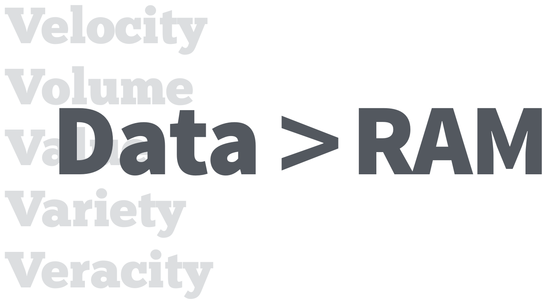
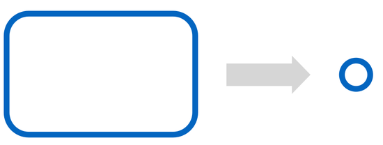
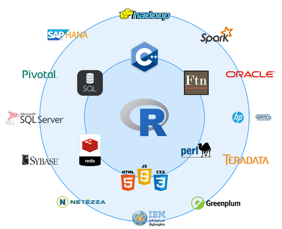
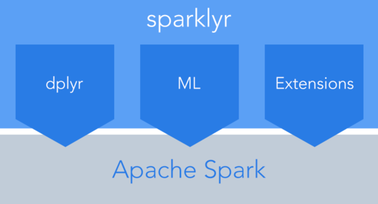

```{r setup, include=FALSE}
knitr::opts_chunk$set(echo = TRUE,cache=TRUE)
```

<br/>
<span style="float: right;width: 175px;" src="">
</img>
</span>
<h1 style="font-size: 2.5em"> Tecnologías de procesamiento Big Data</h1>
<br><br>
<span style="float: right; text-align: right;"><eph>2019</eph></span>
<br>

---

## R y Big Data

### Plantamiento general

R es un entorno y lenguaje de programación enfocado en el análisis estadístico y la visualización. 

Como sabemos es ampliamente utilizado en la ciencia de Datos, pero ¿Qué podemos hacer cuando R solo no basta? Por ejemplo, cuando nuestros datos son demasiado grandes, cuando tenemos que hacer muchas pruebas o iteraciones y los tiempos de cómputo son muy grandes...


### Tipos de problemas "BIG"

<center style='margin:20px;'>

</center>

R de manera general trabaja con los datos en memoria (RAM), así que si nuestros datos son mayores que la RAM del ordenador en el que estamo trabajando nos encontraremos un error como el siguiente:

```{r,warning=TRUE,message=TRUE}
tryCatch(
  sample(1:2,1e10,replace = T),
  error = function(e) {print(e)}
)
```

Además trabaja en [*monohilo*](https://es.wikipedia.org/wiki/Hilo_(inform%C3%A1tica)) por defecto así que aunque tengamos 40 cores como en esta máquina solo estaremos usando un core con R.

```{r,engine='bash'}
nproc --all
```


A continuación vamos a ver algunos de los problemas más normales que nos encontramos en el análisis de datos y algunas ideas de estratégias que podemos seguir.

&nbsp;   
&nbsp;   

### Extract Data
<center style='margin:20px;'>

</center>

En general, los datos que queremos utilizar desde R estarán
almacenados en un *Data Warehouse* ya sea MySQL, OracleSQL, Teradata, MongoDB, Hive...

Desde R hay multitud de paquetes para conectarnos con los principales DW y poder descargar a la sesión de R las tablas.

Por ejemplo:

```{r}
library(RMySQL)
conn <- dbConnect(
  MySQL(), user='root', password='root', dbname='movielens', host='127.0.0.1'
)

dbListTables(conn)

movies <- dbReadTable(conn,'movies')

dim(movies)
str(movies)
head(movies)

ratings <- dbReadTable(conn,'ratings')
head(ratings)
dim(ratings)
```

En muchas ocasiones los datos que queremos importar serán muy grandes, siempre podemos hacer parte de las operaciones en SQL y después importar el resultado a R:

```{r,fig.align='center'}
agregado <- dbGetQuery(conn,"select round(rating) as rating, count(*) as N from ratings group by 1 order by 1")

head(agregado)
str(agregado)

library(ggplot2)
ggplot(agregado,aes(x=rating,y=N)) + 
  geom_bar(stat="identity") +
  theme_bw()

```


En muchas ocasiones aunque tengamos un gran volumen de datos podemos trabajar con una muestra. Es bien conocido que si usamos una muestra representativa y suficientemente grande los resultados que obtengamos con esta muestra van a ser muy parecidos a trabajar con los datos reales (esto lo sabemos gracias a la teoría de la probabilidad y teoremas como ["La ley de los grandes números"](https://es.wikipedia.org/wiki/Ley_de_los_grandes_n%C3%BAmeros)).

Por ejemplo:

```{r}
# Con todos los datos
mean(ratings$rating)

# Solo usando el 10%
mean(dbGetQuery(conn,'select rating from ratings where rand() <= .1')$rating)


dbDisconnect(conn)
rm(agregado, movies, ratings, conn);gc()
```


Al igual que hemos leído tablas de MySQL, podríamos hacerlo para MongoDB, Teradata, Hive (Lo veremos)...

<center style='margin:20px;'>

</center>

&nbsp;   
&nbsp;   
&nbsp;   


### Embarrassing parallel
<center style='margin:20px;'>

</center>

Hablamos de "*Embarrassing parallel*" cuando queremos paralelizar un proceso donde cada trozo no depende de ningún otro, este tipo de problemas son los más fácil de paralelizar ya que los procesos no necesitan comunicarse entre ellos.

Supogamos que queremos hacer una similulación de Monte Carlo, en estos casos es necesarios hacer muchas repeticiones para que la distribución muestral converga a la real de nuestro experimiento, por ejemplo:

```{r}
simulador_loteria <- function(x){
 
  premiado <- sample(100000,1)
  return(premiado == x)
   
}

simulador_loteria(17381) #nos dice si nos ha ocad0 el premio de la loteria
```

&nbsp;   

¿Cual es la probabilidad de qué me toque el gordo?

```{r}
n_simulaciones <- 100000

set.seed(1234)
simulaciones <- sapply(1:n_simulaciones,function(x) simulador_loteria(17381)) #10000 simulaciones de mi simulacion
sum(simulaciones/n_simulaciones)
1/100000
```

&nbsp;  

Podemos paralelizar estas simulaciones, por ejemplo con los cores del ordenador:

```{r}
library(parallel)
parallel::detectCores() #nos dice cuantos cores detecta

n_simulaciones <- 5000000
simulaciones <- mclapply( #multicore apply para aplicar 500000 simulaciones
  1:n_simulaciones,
  function(x) simulador_loteria(17381),
  mc.cores = 40
)

sum(unlist(simulaciones)/n_simulaciones)
1/100000
```

Hemos visto como paralelizar con el paquete `parallel` para utilizar todos los cores de nuestra máquina. Cuando necesitamos todavía más parelización podemos usar un cluster, ya sea usando el protocolo [MPI](https://en.wikipedia.org/wiki/Message_Passing_Interface) con el paquete `Rmpi` o usando por ejemplo un cluster de Spark como veremos más adelante.


&nbsp;   
&nbsp;   
&nbsp;   


### Compute on the whole
<center style='margin:20px;'>

</center>

Este último tipo de problema es el más complicado de todos, es en el que tenemos muchos datos (>RAM) y además el problema que queremos resolver implica a todos los datos a la vez, con lo cual no podemos extraer solo una muestra como en el punto (1) ni utilizar la estrategia del punto (2) ya que los procesos no son independientes.

Aquí es donde el uso de un framework como Spark nos va a resultar de gran ayuda ya que nos permitirá trabajar con DataFrames de Spark para procesar los datos y podremos usar la librería *Machine Learning* de Spark donde ya vienen implementados muchos algoritmos para trabajar de manera distribuida.

**NOTA:** Los algoritmos hechos en R como puede ser `lm`, `glm`, `rpart:rpart`, `kmeans` no están programados para ser ejecutados en distribuido y por lo tanto no nos servirán si queremos trabajar a con todos los datos a la vez (>RAM).

&nbsp;   
&nbsp;   
&nbsp;   


## R + Spark

<center>

</center>
<br/>

Existen dos alternativas para trabajar con Spark y R:

* [`sparkR`](https://spark.apache.org/docs/latest/sparkr.html): Es el oficial del
proyecto Apache.
* [`sparklyr`](http://spark.rstudio.com/): Desarrollado por Rstudio. FUNCIONA ALGO MEJOR

&nbsp;   
&nbsp;   
&nbsp;   


